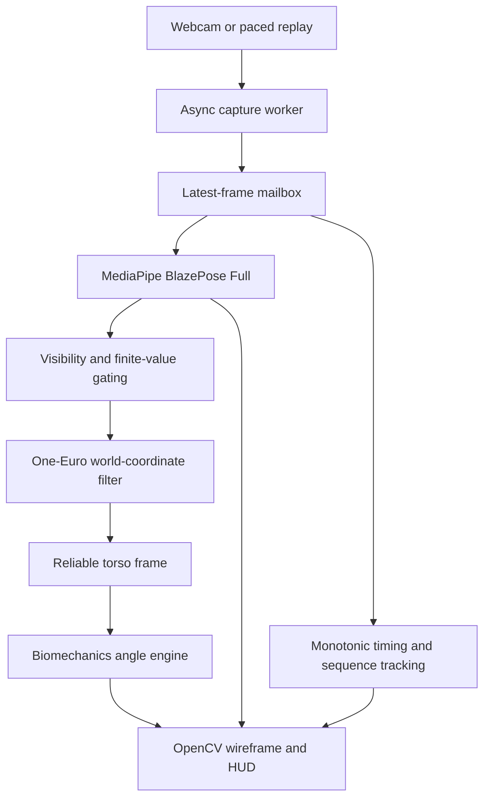

# Real-Time Biomechanical Analysis System

A desktop computer-vision application that estimates twelve bilateral joint
angles from one fixed monocular webcam. It combines asynchronous camera polling,
MediaPipe BlazePose Full, adaptive One-Euro smoothing, neutral-zero geometry and
a translucent OpenCV diagnostics HUD.

**Submission status:** the capture, geometry, filtering, desktop integration and
automated benchmarking are implemented, including orientation-aware torso
projections, static reference-pair collection and accuracy reporting. The test
suite passes. The repo includes an executed **600-frame real-model human-photo
replay benchmark** and **54 known-target synthetic validation holds**, with raw
CSVs, provenance, JSON reports and populated tables below. Physical webcam/desktop
throughput and manual-reference accuracy have not been measured; the automated
evidence is explicitly separated from those outstanding rubric requirements.
See the [final regression audit](docs/REGRESSION_AUDIT.md) for the latest fixes,
strict test results and headless smoke measurements.

## System architecture



The daemon worker drains camera frames independently of model/UI processing. It
publishes immutable frame snapshots with sequence numbers and host timestamps.
The main thread processes each fresh sequence once, keeping UI operations on the
same thread. HighGUI calls from other threads are explicitly rejected before
entering native window code. A brief mailbox lock protects publication; frame copying, inference,
filtering and rendering occur outside that lock.

The mailbox retains only the latest frame. Slow consumers intentionally supersede
older frames instead of accumulating delay. This is a bounded-latency design,
not lossless video recording or a guarantee of zero camera/driver frame drops.

| Component | Responsibility |
| --- | --- |
| `core/capture.py` | Camera lifecycle, daemon worker, latest-frame snapshots, safe ownership |
| `core/pose.py` | Lazy local BlazePose Full construction and model configuration |
| `core/biomechanics.py` | Vector math, body/camera frames, confidence-gated bilateral angles |
| `core/filter.py` | Array-based One-Euro smoothing and optional calibrated bone-length checks |
| `main.py` | Shared pipeline, pose inference, HUD, controls, sliding diagnostics |
| `benchmark.py` | Synthetic/recorded/webcam runs, full-run statistics, JSON export |
| `core/validation.py`, `validation.py` | Static paired holds, quality checks, per-joint/view accuracy reports |
| `tests/` | Geometry, signal, lifecycle, integration and benchmark regression tests |
| `benchmarks/` | Replay preparation, synthetic validation, raw reports and evidence verification |

## Technology choices

**MediaPipe BlazePose Full.** `model_complexity=1` selects the Full landmark model.
The model supplies 33 inferred 3D world landmarks in meters relative to the hip
midpoint. These estimates support 3D segment angles without the direct
foreshortening and unequal image-axis scaling of 2D pixel geometry. They remain
inferred monocular coordinates, not calibrated motion-capture ground truth.
Normalized image landmarks are used only for the wireframe and visibility scores.
The model runs with `smooth_landmarks=False`, since the application explicitly
filters world coordinates; segmentation is disabled to avoid unused work.

**Python, NumPy and OpenCV.** These keep camera ingestion, numerical operations
and native model execution in a small desktop stack. One capture thread and one
processing/UI thread avoid per-frame IPC, web-view serialization and extra UI
processes. Electron/Tauri wrappers would add packaging and communication work
without helping this project's simple HUD. This is an architectural rationale,
not a measured performance comparison with those frameworks. Hardware still
determines whether 30-60 FPS is achievable.

**Dependency compatibility.** The requested legacy `mp.solutions.pose.Pose` API
is pinned to MediaPipe 0.10.21. The application uses `opencv-contrib-python`, which
MediaPipe already requires and which supplies `cv2`; installing multiple OpenCV
wheel variants in one environment can overwrite the same module. NumPy is bounded
below version 2 for this dependency set. Python 3.10-3.12 is recommended.
On Python 3.12, the pinned protobuf 4.x native map containers emit two known
[upstream import deprecations](https://github.com/protocolbuffers/protobuf/issues/15077).
`core/pose.py` scopes compatibility handling to those exact two messages during
import. Other warnings, including inference warnings, retain the caller's policy;
there is no global warning suppression. The strict suite also checks real nonempty
landmark-packet decoding in a fresh interpreter.

## Goniometric reference and mathematics

All values are degrees. Anatomical neutral is zero, not the interior angle of a
straight segment. Every row is returned for both `L_` and `R_` prefixes: six
measurements per side, twelve total.

| Dictionary suffix | Landmark triplet | Neutral-zero formula and sign |
| --- | --- | --- |
| `Elbow_Flex` | Shoulder-elbow-wrist: 11-13-15 / 12-14-16 | `180 - interior`; straight extension = 0, flexion positive |
| `Knee_Flex` | Hip-knee-ankle: 23-25-27 / 24-26-28 | `180 - interior`; straight extension = 0, flexion positive |
| `Shoulder_Flex` | Hip-shoulder-elbow: 23-11-13 / 24-12-14 | Signed sagittal angle; arm at side = 0, flexion positive, extension negative |
| `Shoulder_Abd` | Hip-shoulder-elbow: 23-11-13 / 24-12-14 | Signed coronal angle; arm at side = 0, abduction positive, adduction negative |
| `Hip_Flex` | Shoulder-hip-knee: 11-23-25 / 12-24-26 | Signed sagittal angle from downward trunk ray to thigh; standing = 0, flexion positive, extension negative |
| `Ankle_Dorsi_Plantar` | Knee-ankle-foot index: 25-27-31 / 26-28-32 | `interior - 90`; neutral right angle = 0, plantarflexion positive, dorsiflexion negative |

For a triplet `(a, b, c)`, the interior angle at `b` is:

```text
u = a - b
v = c - b
interior = degrees(acos(clamp(dot(unit(u), unit(v)), -1, 1)))
```

Euclidean norms, normalized dot products and cross products use finite checks.
Even finite components whose combined norm overflows return unavailable without
emitting numerical warnings. Visibility entries must be scalars; malformed nested
confidence arrays are rejected instead of implicitly converted.
Segments with length at most `1e-7` have no defined direction and return `None`.
Cosines are clamped to `[-1, 1]`; epsilon is used as a validity guard rather than
adding a bias to every denominator.

### Body-aligned plane separation

The application and benchmark default to `--coordinate-frame body`. Four reliable
torso anchors (both shoulders and hips) define an orthonormal frame:

1. Torso-down is the normalized hip-midpoint minus shoulder-midpoint direction.
2. Subject-left averages the normalized right-to-left shoulder and hip spans,
   then removes its component along torso-down (Gram-Schmidt).
3. Posterior is `cross(left, down)`. Points are expressed in this left/down/posterior
   basis relative to the hip midpoint. Local anterior is negative Z.

The frame follows modeled subject yaw, roll and pitch, so local X-Y/Y-Z represent
estimated torso coronal/sagittal planes. Rigid-transform tests preserve angles
through side and back rotations; they do not establish real-model yaw accuracy.
Missing anchors, collapsed torso spans, over 60-degree disagreement between hip
and shoulder lateral directions, or a nearly collinear lateral/down direction
invalidate frame-dependent shoulder/hip measurements. Elbow, knee and ankle
continue using their reliable 3D triplets. No stale frame is reused after occlusion.

| Motion | Projection | Reference |
| --- | --- | --- |
| Shoulder abduction/adduction | Body coronal X-Y: discard local Z | Torso-down reference versus shoulder-to-elbow ray |
| Shoulder flexion/extension | Body sagittal Y-Z: discard local X | Shoulder-to-hip ray versus shoulder-to-elbow ray |
| Hip flexion/extension | Body sagittal Y-Z: discard local X | Reverse hip-to-shoulder ray versus hip-to-knee ray |

In body mode the coronal shoulder reference removes the diagonal ipsilateral
hip-ray's lateral component. Otherwise ordinary differences between shoulder and
hip widths would create an apparent abduction angle with the arm straight down.
The shoulder/hip landmarks still define the torso frame and visibility gate;
camera mode retains the original raw projected-triplet formula. This is a
documented anatomical-reference correction, covered by unequal-width tests.

Signed projected angles use `atan2(signed cross component, normalized dot)`.
Nearly out-of-plane rays are rejected when projected length is below 5% of
the 3D segment length; this heuristic guards ill-conditioned directions and
requires real-motion tuning. The exact opposite ray is consistently reported
as +180 degrees because its direction of rotation is geometrically ambiguous.
Other directions within 0.5 degrees of that antiparallel ray return `None` instead
of alternating between nearly +180 and -180 under small noise. This is an explicit
uncertainty band, not temporal angle unwrapping; larger excursions across the
principal-angle branch cut still require anatomical interpretation.
The low-level engine preserves `coordinate_frame='camera'` as its compatibility
default; the desktop explicitly selects body mode. `--coordinate-frame camera`
retains fixed camera X-Y/Y-Z and requires front alignment. Its default signs assume
anterior is -Z and subject-left is +X; low-level callers can reverse those signs.
Signs in body mode follow landmark identities. Root-relative coordinates alone
do not provide anatomical alignment; the explicit torso transform is required.

A segment perpendicular to a projection plane has no projected direction. For
example, exact 90-degree pure abduction produces `None` for sagittal shoulder
flexion; it does not imply a measured zero. The audit reference ranges (elbow 0-150 degrees and knee 0-135 degrees) are
covered by endpoint tests. The engine preserves geometric results up to 180
degrees rather than clipping to those references; normal ROM varies by
population and a nominal maximum is not a calibrated measurement limit.
Elbow/knee triplet geometry cannot
distinguish hyperextension from flexion. Ankle-to-foot-index geometry is a proxy
for a foot segment, not the clinical ankle axis. Trunk movement also affects
shoulder/hip reference rays.

### Subject positioning and camera setup

Keep one camera fixed, approximately level, far enough away to include the full
body and feet. Use steady lighting and clothing that leaves joint locations clear.
Face the camera for abduction; turn toward a side/oblique view for flexion and
extension to expose the moving limb. Body mode follows this orientation change.
An exact side view can hide the opposite torso anchors: if the HUD reports
`Torso frame unavailable`, use a slightly oblique stance where both shoulders and
hips remain reliable. Missing far-side measurements stay unavailable.

Maintain a stable trunk during isolated joint holds and reset (`r`) after changing
measurement setup. No multi-camera, depth sensor, known-body-scale calibration
or automatic anatomical neutral calibration is required. The model's inferred
world scale and torso-derived planes remain approximations; verify neutral and
known bends against the reference assessor. Camera intrinsic/lens calibration is
not implemented, so avoid wide-angle image edges and validate at the actual
distance/view used. A torso frame is not a calibrated scapular or pelvic frame.

## Depth jitter and noise mitigation

The vectorized One-Euro filter processes a `(33, 3)` array independently per
coordinate. Application defaults are `min_cutoff=1.0 Hz`, `beta=5.0`,
`d_cutoff=1.0 Hz` for coordinates in meters. The reusable `OneEuroFilter` class
retains beta=0.007 for API compatibility; app/benchmark/validation pass beta=5.
Using timestamp intervals in seconds:

```text
velocity = (raw_current - raw_previous) / dt
filtered_velocity = low_pass(velocity, d_cutoff)
cutoff = min_cutoff + beta * abs(filtered_velocity)
alpha = 1 / (1 + 1 / (2*pi*cutoff*dt))
filtered_position = alpha*raw_current + (1-alpha)*filtered_previous
```

Lower `min_cutoff` suppresses static jitter at the cost of lag. Increase `beta`
when dynamic motion is too delayed. Beta depends on units: 0.007 adapts only
weakly at ordinary meter-scale speeds. Beta=5 is selected from analytical
meter-scale checks, not a universally validated human-motion tuning.
Causal smoothing reduces the jitter/lag tradeoff but does not eliminate lag.

Reproduce the tuning experiment:

```bash
python benchmarks/filter_response.py --output benchmarks/results/my_filter_response.json
```

The [measured analytical report](benchmarks/results/orientation_filter_response.json)
uses seeded 0.02 m noise and a 3 m/s ramp at 60 Hz. Beta=0.007 gives 95.03%
stationary variance reduction and 155.88 ms equivalent steady coordinate lag;
beta=5 gives 89.84% reduction and 9.95 ms lag. These are signal experiments,
not observed human joint-angle errors or guarantees of zero motion lag.

Visibility must be finite and **strictly greater than 0.65** for every involved landmark;
exactly 0.65 is rejected to match the audited threshold. Missing, low-confidence or nonfinite coordinates are masked,
never extrapolated into a valid angle. Invalid filter components return NaN and
restart at their next valid observation. Pose loss and the `r` key reset history.
The filter also accepts a whole-frame `None`: all established components become
unavailable and reinitialize independently when valid data returns. An initial
`None` returns scalar NaN without committing a shape or timestamp.
Duplicate/backward timestamps hold valid components; invalid components still
clear history and return NaN;
positive intervals at most `1e-12 s` are also guarded. Reset after a tracking gap
when missing observations were not passed to the filter.

The optional `BoneLengthConstraintChecker` freezes reliable calibrated upper-arm
and shin lengths and flags relative drift above 20% by default. Custom segments
and tolerances are supported. Missing/occluded segments return an unavailable
verdict. It neither warps coordinates nor silently learns a drifting baseline.
Calibrate with median coordinates from trustworthy stable frames; the desktop app
does not enable this checker automatically without an explicit baseline.

## Setup and execution

### 1. Clone and create an isolated environment

```bash
git clone https://github.com/satishkumar123123/realtime-biomechanics-engine.git
cd realtime-biomechanics-engine
python -m venv venv
```

Windows PowerShell:

```powershell
.\venv\Scripts\Activate.ps1
```

Linux/macOS:

```bash
source venv/bin/activate
```

### 2. Install dependencies

```bash
python -m pip install --upgrade pip
python -m pip install -r requirements.txt
```

Use a fresh environment rather than mixing `opencv-python`, contrib and headless
wheel variants. A desktop session and camera access are needed for the UI.

### Model download and offline inference

MediaPipe **0.10.21 bundles the Full landmark model** (`model_complexity=1`)
and pose detector in its wheel. Installing `requirements.txt` installs the model;
there is no separate asset download command or first-run cloud inference call.
After dependencies are installed, `main.py` runs locally without network access.
Do not change to Lite/Heavy here: the legacy API may download those assets if absent.

Verify the bundled Full asset from the activated environment:

```bash
python -c "from pathlib import Path; import mediapipe as mp; p=Path(mp.__file__).parent/'modules/pose_landmark/pose_landmark_full.tflite'; print(p); assert p.is_file(), 'Reinstall requirements.txt: Full model missing'"
```

On Windows/macOS, allow camera access for the terminal/Python application. On
Linux use a graphical desktop session and ensure the user can access the camera
device; an OpenCV camera error should be resolved before running performance tests.

### 3. Run the desktop application

```bash
python main.py
python main.py --camera 0 --width 640 --height 480 --fps 60
python main.py --coordinate-frame body
# Compatibility mode for a front-aligned subject:
python main.py --coordinate-frame camera --beta 0.007
```

The semi-transparent sidebar displays all twelve metrics, degree symbols,
wireframe feedback, current/mean inference time, capture-to-UI mean/P95 and
achieved FPS. Both inference and pipeline timings include rolling mean and P95.
Unreliable values are red `Occluded / Low Conf`; reliable inputs with
degenerate geometry show `Undefined geometry`.
Frame-dependent measurements show `Torso frame unavailable` when the torso basis
cannot be trusted. The HUD title identifies body/camera mode.

| Control | Action |
| --- | --- |
| `q` or ESC | Exit and close camera/model/window |
| `r` | Reset filter history |
| Window close | Exit cleanly |

Camera stalls/disconnections produce a readable error and attempt owned-resource
cleanup. Backend release failures are surfaced as OSError rather than hidden.
If a native driver read never returns, `stop()` raises a bounded `TimeoutError`;
Python cannot safely force-cancel every camera backend's read. The daemon releases
the camera once that call returns. Camera settings are requests, not promises.

### 4. Run automated benchmarks

Default: **300 measured frames**, preceded by **30 warmup frames**, at a requested
640x480 / 60 source FPS. Model initialization and warmup are excluded.

```bash
# Real MediaPipe, synthetic blank images, real HUD rendering, no window:
python benchmark.py --output benchmarks/results/my_synthetic.json

# Time-based run: ten measured seconds after warmup:
python benchmark.py --seconds 10

# Detected-human workload from a recorded video, letterboxed and paced at 60 FPS:
python benchmark.py --source recorded --video recordings/movement.mp4 --frames 300

# Target-machine webcam and desktop UI workload:
python benchmark.py --source webcam --camera 0 --seconds 30 --display --require-human --output benchmarks/results/webcam_desktop.json

# Explicit mock inference to exercise all twelve numeric measurements:
python benchmark.py --mock-pose --frames 300
```

`--frames` and `--seconds` are mutually exclusive. `--warmup`, `--fps`, resolution,
filter parameters and `--output` are configurable; see `python benchmark.py --help`.
Recorded files loop at EOF. Source frames are paced by host time, not recording
exposure timestamps; decoding/resizing happens in the worker before the capture
timestamp. Letterboxing preserves aspect ratio instead of stretching the person.
A blank input is not a detected-human workload; a mock pose is not model inference.
The report states source, model, pose coverage, hardware and timing scope.
It also reports individual metric availability and detected-pose-only latency
statistics, so a fast no-person detector path cannot hide landmark workload cost.
`--require-human` saves the report and returns exit code **2** unless real local
inference, physical webcam, visible desktop, >=10 measured seconds, >=80% pose
coverage, >=50% frames with a valid metric, and >=30 FPS are all observed. Coverage
and duration checks are this project's evidence policy, not extra assignment
accuracy limits. Ordinary diagnostic runs return 0 even when those checks fail.

### 5. Execute the test suite

```bash
python -m pip install -r requirements-dev.txt
python -m pytest -q -W error
```

A stdlib-only runner is also supported after runtime dependency installation:

```bash
python -m unittest discover -s tests -v
```

Tests cover known neutral/right-angle geometry, projection separation, signs,
occlusion, degenerate data, Gaussian jitter reduction, dynamic filtering,
timestamp guards, camera ownership, reset/exit/disconnect behavior, real async
capture with mock inference, real MediaPipe blank-frame inference, recorded replay
and benchmark statistics. Tests do not require a physical webcam or GUI window.
The real model smoke test is skipped if MediaPipe is not installed.
Orientation regressions additionally cover side/back views, rigid transforms,
contradictory/missing torso anchors and metric-scale filter tuning. Validation tests
cover neutral zero, rejected/occluded holds, error formulas, schema checks and CLI
collection/reporting. Lifecycle regressions include interrupted thread startup,
single-owner release and backend garbage collection after chained driver failures.
Headless benchmark/validation tests prohibit every HighGUI call, and native display
tests cover main-thread enforcement and event-pump failure cleanup.
The 3 October data/tooling update passes **126 tests and 137 subtests** with
`-W error`. The [2 October regression audit](docs/REGRESSION_AUDIT.md) records
the preceding lifecycle/numerical audit and its historical test count.

## Benchmark definitions and measured results

**Achieved end-to-end FPS** is `(measured_frames - 1) / (last_completion -
first_completion)`. Inference statistics time only `pose.process`; color
conversion is excluded. Pipeline latency starts at host camera/replay read
completion and ends after HUD rendering plus the display sink/event pump.
Headless mode excludes OS window presentation cost. Neither mode measures sensor
exposure time or actual screen photons. The desktop HUD uses sliding 120-frame
windows; benchmark mean/min/max/P95 use every post-warmup measured frame.
The benchmark also prints/exports the final 120 measured-frame rolling window,
excluding warmup even when fewer than 120 measurements are available.

Mailbox overruns are sequence gaps between the first and last measured frames:
`superseded = (last_sequence - first_sequence) - (measured_frames - 1)`.
Overrun events count gaps greater than one. Startup, warmup and unconsumed tail
frames are excluded. OpenCV does not expose reliable hardware/driver drop counts;
those are reported as unknown, not zero.

### Executed automated replay benchmark — 3 October 2026

This run uses **real local MediaPipe BlazePose Full inference** on a generated
720-frame human-photo replay. The official MediaPipe test photograph is
letterboxed and given small cyclic image translations, scale changes and roll.
It exercises detected-person tracking, world-coordinate filtering, all twelve
angles and the real HUD renderer. It is **one augmented photograph**, not changing
human articulation, a physical webcam run or visible desktop presentation.

| Environment / setting | Recorded value |
| --- | --- |
| OS | Linux-6.18.44-x86_64-with-glibc2.39 |
| CPU | AMD EPYC 9V74 80-Core Processor |
| Allocation | 8-core container quota; 9 logical CPUs visible |
| Runtime | Python 3.12.14; MediaPipe 0.10.21; OpenCV 4.11.0; NumPy 1.26.4 |
| Input resolution / pacing | 640x480; generated 60 Hz MJPEG replay; no physical camera |
| Model | BlazePose Full, complexity 1, CPU/XNNPACK, built-in smoothing and segmentation disabled |
| Custom processing | One-Euro 1 Hz / beta 5 / derivative cutoff 1 Hz; body coordinates; visibility >0.65 |
| Display | Headless sink with actual OpenCV wireframe/HUD rendering |
| Sample | 60 warmup + **600 measured frames**; 14.817 s measured interval |
| Coverage | 600/600 poses; 100% numeric coverage; 12.00/12 mean reliable metrics |
| Achieved end-to-end FPS | **40.43 FPS** |
| Mailbox | 277 superseded frames / 876 publication intervals; 276 overrun events; 31.62% |
| Hardware/driver drops | Unknown; no physical-camera driver measurement |
| Replay loops during whole run | 1 |

| Measured latency | Mean (ms) | Min (ms) | Max (ms) | P95 (ms) |
| --- | ---: | ---: | ---: | ---: |
| Real model inference | 21.113 | 19.592 | 40.217 | 23.657 |
| Host end-to-end pipeline | 32.578 | 23.511 | 52.691 | 40.309 |

The 60 Hz producer is faster than the consumer on this host; the latest-frame
mailbox intentionally supersedes older frames. Its nonzero overrun count is part
of the result. End-to-end latency begins **after replay decoding/read completion**;
source generation, decoding, sensor exposure and actual screen presentation are
outside that clock interval. This single run is not a multi-run confidence bound.

- [Exact benchmark results](benchmark_results.json), including the final 120-frame window.
- [All 600 per-frame timing/sequence records](benchmark_frame_samples.csv).
- [Input provenance, source/video SHA-256 and augmentation recipe](benchmarks/results/replay_manifest.json).

Reproduce from the repository root after dependency installation:

```bash
python -m benchmarks.prepare_replay --download
python -W error benchmark.py --source recorded --video benchmarks/assets/human_replay.avi --input-manifest benchmarks/results/replay_manifest.json --frames 600 --warmup 60 --fps 60 --samples-output benchmark_frame_samples.csv --output benchmark_results.json
```

The first command downloads the checksum-pinned public image once and generates
local media. Subsequent generation can omit `--download`; model inference is
fully local. Downloaded/generated images and videos are excluded from git; the
raw measurement dataset and recipe are committed. Codec versions may produce a
different video hash when regenerated; benchmark verifies the paired manifest.

The earlier [blank-input report](benchmarks/results/synthetic_headless.json) and
[regression measurements](docs/REGRESSION_AUDIT.md) remain historical smoke results.
The current person-containing replay gives more useful model timing than a blank
frame, while still lacking actual human-motion and desktop-camera conditions.
The strict desktop evidence checks correctly remain false for `physical_webcam`
and `desktop_display`. Repeat measurements on the target machine using
`--source webcam --display --seconds 30 --require-human`; preserve every run,
configuration, coverage and mailbox count instead of selecting only the best run.

## Accuracy validation and measured simulated results

### Executed goniometric simulation — 3 October 2026

Known targets are generated by **independent forward kinematics**, using metric
segment lengths and commanded joint rotations. These landmarks pass through the
same `PoseProcessor`, visibility gating, One-Euro filtering, body-frame geometry
and static-hold validation tooling used by the application. This experiment
**bypasses image capture and MediaPipe inference**; it measures the specified
geometry/noise/filter simulation, not model landmark error or clinical accuracy.
Its targets do not annotate the photograph used for the performance benchmark.

Protocol: seed `20261003`, both sides, three repeated holds per target/view,
60 Hz timestamps, a 0.5-second transition inside one second of excluded settling,
then two measured seconds per hold. Elbow/knee use a 90-degree subject yaw so the
flexion motion lies in the camera image plane. Shoulder flexion uses 0- and
45-degree yaw, retaining a camera-depth component. The camera axes stay fixed.
Camera-axis Gaussian coordinate noise has standard deviations **3/3/10 mm** in
X/Y/Z, with **6 mm, 9 Hz** depth flicker and four low-confidence frames per hold.
These are declared artificial stress parameters, not fitted MediaPipe error.
Filters reset between holds; missing keypoints exercise the usual reacquisition
path. Visible torso anchors are synthesized, not estimated from an image.

Executed **9,774 processor frames**, **54 accepted / 0 rejected holds**.
Each hold contributes one filtered median; the table's measured angle is the mean
of those medians. MAE/Bias/RMSE are computed from individual hold errors, not from
the difference between the two aggregate means. Full precision, each side/view
and rejection accounting remain in the raw/report files.

| Joint | Expected target (deg) | Mean measured (deg) | Holds | MAE (deg) | Bias (deg) | RMSE (deg) |
| --- | ---: | ---: | ---: | ---: | ---: | ---: |
| Elbow flexion | 0 | 1.1427 | 6 | 1.1427 | 1.1427 | 1.1761 |
| Elbow flexion | 90 | 89.9872 | 6 | 0.1116 | -0.0128 | 0.1367 |
| Elbow flexion | 135 | 135.0457 | 6 | 0.0469 | 0.0457 | 0.0579 |
| Knee flexion | 0 | 0.7333 | 6 | 0.7333 | 0.7333 | 0.7415 |
| Knee flexion | 90 | 89.9495 | 6 | 0.0866 | -0.0505 | 0.1046 |
| Shoulder flexion | 45 | 45.0171 | 12 | 0.0856 | 0.0171 | 0.1007 |
| Shoulder flexion | 90 | 89.9461 | 12 | 0.1328 | -0.0539 | 0.1659 |

| Simulated group | Holds | MAE (deg) | Bias (deg) | RMSE (deg) |
| --- | ---: | ---: | ---: | ---: |
| In-plane elbow/knee | 30 | 0.4242 | 0.3717 | 0.6270 |
| Out-of-plane shoulder | 24 | 0.1092 | -0.0184 | 0.1373 |

The unsigned elbow/knee estimator has a positive noise floor at straight neutral,
which contributes to the larger in-plane aggregate here. The small shoulder error
reflects this particular symmetric noise model, visible synthetic torso and
static median averaging; it does **not** show that monocular out-of-plane anatomy
is more accurate. Learned landmark bias, perspective/model failures, clothing,
true self-occlusion, subject variability and manual-reference uncertainty are
not reproduced. No human participants or manual goniometer readings are present.

- [Raw per-hold reference/measurement pairs](benchmarks/results/simulated_accuracy/holds.csv).
- [Full synthetic accuracy JSON](benchmarks/results/simulated_accuracy/accuracy.json).
- [Populated Goniometric Accuracy Report](benchmarks/results/simulated_accuracy/accuracy.md).

```bash
python -W error validation.py simulate --seed 20261003 --repetitions 3 --output-dir benchmarks/results/simulated_accuracy
python -W error -m benchmarks.verify_results
```

The verification command recomputes FPS, latency distributions, rolling windows,
mailbox counts and synthetic MAE/Bias/RMSE from the committed CSVs and checks their
hashes. It needs no webcam, GUI, model inference or media download. Raw CSV files
preserve LF line endings on Windows and Unix for stable hashes. Repeating the
simulation reproduces numerical results for the same runtime/seed; timestamps
and the checksum containing those timestamps will change. Rows are marked
`synthetic:` in their reference method, and the reporting tool refuses to combine
synthetic and physical/reference studies into one accuracy report.

### Physical manual-goniometer protocol

The automated evidence above is populated and reproducible. The assignment's
physical desktop-camera run and paired manual-reference study have **not been
performed**, so full physical/clinical rubric completion is not claimed. Conduct
the following protocol with a standard manual 360-degree plastic baseline
goniometer operated by a trained assessor:

1. Record participant characteristics, joint/side, clothing, lighting, camera
   distance/orientation, model/filter settings and chosen measurement positions.
   Obtain appropriate consent and use participant IDs in the saved data.
2. Verify the goniometer's zero/right-angle references. The assessor documents
   joint-specific pivot and proximal/distal bony alignment using an accepted
   goniometric measurement procedure. Apply the same neutral/sign conventions
   to manual and software readings.
3. Collect neutral plus several comfortable, assessor-approved static positions
   across each joint's available range. Use at least three repeated holds per
   position and side. Sample a stable two-second software interval during each
   matched manual reading; use its median, excluding settling time.
4. Evaluate frontal, side/oblique views and controlled rotations separately.
   Document frame mode and orientation. Body-frame geometric rotation tests do
   not establish MediaPipe's real out-of-plane landmark accuracy.
5. Have the assessor record the manual reading without seeing the software
   estimate. A second trained assessor repeats a subset to quantify reference
   variability. Manual readings are a comparator, not error-free ground truth.
6. Store one paired result per hold: participant, joint, side, view, repetition,
   reference angle, software median, valid-frame coverage and exclusion reason.
   Report rejected/occluded observations rather than imputing zeros.
7. Compute MAE, signed bias, RMSE and uncertainty per joint, side and view.
   Resample participants/holds for uncertainty rather than treating correlated
   video frames as independent samples. Report sample counts and availability
   alongside error, and include agreement plots when a dataset is collected.

`MAE = mean(abs(software_angle - manual_angle))` over valid paired holds.
Software signs must be matched to the reference before comparison. Dynamic
accuracy/phase lag requires a synchronized reference motion system; a static
manual goniometer protocol cannot establish it.

The assignment explicitly has **no fixed error threshold**. Report observed
error, coverage, procedure and limitations. Earlier illustrative 3.5-7.5-degree
goals are not acceptance criteria or measured results and have been removed.

### Collect and report actual paired measurements

Use the same machine, model/filter settings and fixed camera for a study. Measure
the joint with the assessor's goniometer first; keep the position stable while a
separate operator starts acquisition. The assessor must not view software values.
The `--reference` value must be the actual reading, with the documented signs;
do not enter the desired angle or copy a software reading as ground truth.

The commands below demonstrate syntax only. Replace each reference with its
measured reading. Collect neutral plus several comfortable bends, both sides
where reliable, and at least three repeated holds per position. Give the same
anonymous ID to the same participant. Keep identical configuration per joint/view;
use separate CSV studies when comparing tunings.

```bash
python validation.py collect --participant P01 --joint L_Elbow_Flex --view left-side --reference 90
python validation.py collect --participant P01 --joint L_Knee_Flex --view left-side --reference 90
python validation.py collect --participant P01 --joint L_Shoulder_Flex --view oblique --reference 45
# Repeat holds and sides, replacing references with real assessor readings.
python validation.py report
```

Each acquisition excludes one second of settling and samples a two-second hold.
It stores the software median, coverage, interquartile spread and half-window
median drift with the reference/configuration. Holds with <80% valid coverage,
<5 valid frames, >3-degree spread/drift, a gap over 0.25 seconds between valid
observations (including either window edge), or premature exit are retained as rejected.
These are configurable collector quality heuristics, not clinical error limits.

Default outputs are `validation/data/paired_holds.csv`,
`validation/results/accuracy.json` and `validation/results/accuracy.md`. The
[empty CSV template](validation/template.csv) contains no fabricated records.
Reports use one observation per hold, group by joint/view, and show MAE, signed
bias, RMSE, maximum absolute error, reference range, sample/participant counts and
availability. JSON and Markdown also retain the reference method and measurement
configuration; different reference methods cannot be silently pooled within a
joint/view. Missing required categories cause report exit code 2. Category
presence alone does not establish adequate validation; examine ranges, repetitions,
reference uncertainty and rejected holds. Confidence intervals/agreement plots
are not automated; add them with suitable hold/participant sampling after data
collection. Participant data/generated validation reports are ignored by Git;
publish anonymized evidence explicitly after reviewing it.

## Known limitations and future work

- Monocular line-of-sight occlusion makes distal joints unreliable; the system
  returns unavailable values rather than reconstructing them as reliable.
- Loose clothing can shift visual joint estimates relative to anatomical axes.
- Single-camera depth ambiguity and foreshortening remain despite inferred 3D
  coordinates, particularly for movement along the camera's line of sight.
- The torso-derived body frame depends on reliable bilateral shoulder/hip depth.
  Side-view occlusion, axial twisting and incorrect model left/right identities can
  invalidate it. Camera mode additionally requires front alignment. Neither mode
  provides clinically calibrated scapular/pelvic axes or proven yaw accuracy.
- Neutral-zero segment formulas are geometric proxies: signed hyperextension,
  axial rotation and clinical ankle axes need richer modeling/landmarks.
- Filter tuning trades jitter against lag. Bone-length checks detect drift but
  do not correct depth estimates or establish clinically valid scale.
- Hardware FPS, native-read shutdown and visible presentation latency depend on
  the camera, backend and OS. The latest-frame mailbox intentionally loses history.

Next priorities are a detected-human target-machine benchmark, the paired manual
validation dataset, subject-specific anatomical baseline calibration, filter tuning
from measured motion sequences and migration to the MediaPipe Tasks API. All
planned improvements for this assignment retain the one fixed monocular camera.

## References

- [MediaPipe Pose documentation and world landmarks](https://github.com/google-ai-edge/mediapipe/blob/master/docs/solutions/pose.md)
- [BlazePose model selection implementation](https://github.com/google-ai-edge/mediapipe/blob/master/mediapipe/python/solutions/pose.py)
- [One-Euro filter: original algorithm and tuning](https://gery.casiez.net/1euro/)
- [CDC Joint Range of Motion Study: context and methodology resources](https://archive.cdc.gov/www_cdc_gov/ncbddd/jointrom/index.html)

The external references explain model/filter behavior and measurement context;
none supplies clinical accuracy results for this implementation.

## Evaluation audit

See [Executive Audit Report](docs/AUDIT_REPORT.md) for the rubric compliance
matrix, corrected defects, repeated test evidence and unresolved real-world
validation gaps.
The subsequent [completion report](docs/COMPLETION_REPORT.md) records orientation,
tuning, validation tooling and benchmark evidence added after that audit.
The [assignment compliance check](docs/ASSIGNMENT_CHECK.md) maps the original
requirements to current code and clearly identifies the two physical evidence gaps.
