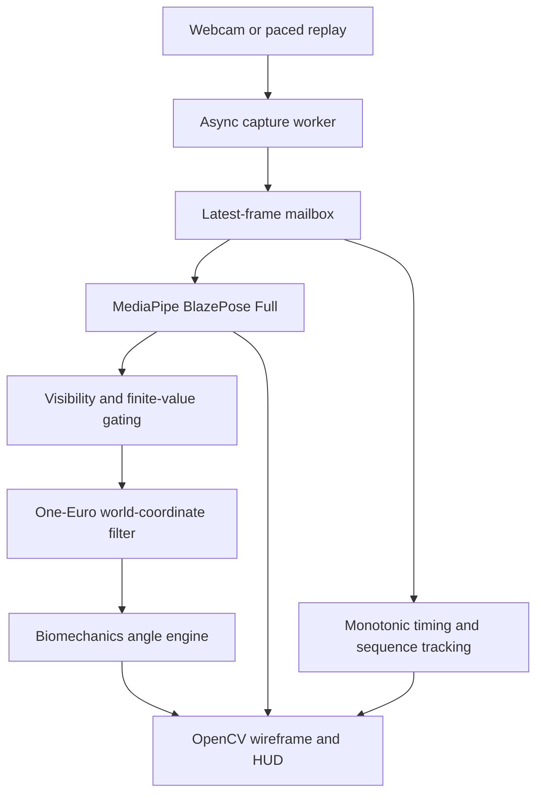

# Real-Time Biomechanical Analysis System

A desktop computer-vision application that estimates twelve bilateral joint
angles from one fixed monocular webcam. It combines asynchronous camera polling,
MediaPipe BlazePose Full, adaptive One-Euro smoothing, neutral-zero geometry and
a translucent OpenCV diagnostics HUD.

**Submission status:** the capture, geometry, filtering, desktop integration and
automated benchmarking are implemented. The test suite passes. A reproducible
synthetic-input performance report is included. Detected-human webcam throughput
and clinical accuracy have not yet been measured; the requested performance and
MAE ranges below are explicitly labeled project targets.

## System architecture



The daemon worker drains camera frames independently of model/UI processing. It
publishes immutable frame snapshots with sequence numbers and host timestamps.
The main thread processes each fresh sequence once, keeping UI operations on the
same thread. A brief mailbox lock protects publication; frame copying, inference,
filtering and rendering occur outside that lock.

The mailbox retains only the latest frame. Slow consumers intentionally supersede
older frames instead of accumulating delay. This is a bounded-latency design,
not lossless video recording or a guarantee of zero camera/driver frame drops.

| Component | Responsibility |
| --- | --- |
| `core/capture.py` | Camera lifecycle, daemon worker, latest-frame snapshots, safe ownership |
| `core/biomechanics.py` | Vector math, camera-plane projections, confidence-gated bilateral angles |
| `core/filter.py` | Array-based One-Euro smoothing and optional calibrated bone-length checks |
| `main.py` | Shared pipeline, pose inference, HUD, controls, sliding diagnostics |
| `benchmark.py` | Synthetic/recorded/webcam runs, full-run statistics, JSON export |
| `tests/` | Geometry, signal, lifecycle, integration and benchmark regression tests |
| `benchmarks/results/` | Reproducible measured benchmark reports |

## Technology choices

**MediaPipe BlazePose Full.** `model_complexity=1` selects the Full landmark model.
The model supplies 33 inferred 3D world landmarks in meters relative to the hip
midpoint. These estimates support 3D segment angles without the direct
foreshortening and unequal image-axis scaling of 2D pixel geometry. They remain
inferred monocular coordinates, not calibrated motion-capture ground truth.
Normalized image landmarks are used only for the wireframe and visibility scores.
The model runs with `smooth_landmarks=False`, since the application explicitly
filters world coordinates; segmentation is disabled to avoid unused work.

**Python, NumPy and OpenCV.** These keep camera ingestion, numerical operations
and native model execution in a small desktop stack. One capture thread and one
processing/UI thread avoid per-frame IPC, web-view serialization and extra UI
processes. Electron/Tauri wrappers would add packaging and communication work
without helping this project's simple HUD. This is an architectural rationale,
not a measured performance comparison with those frameworks. Hardware still
determines whether 30-60 FPS is achievable.

**Dependency compatibility.** The requested legacy `mp.solutions.pose.Pose` API
is pinned to MediaPipe 0.10.21. The application uses `opencv-contrib-python`, which
MediaPipe already requires and which supplies `cv2`; installing multiple OpenCV
wheel variants in one environment can overwrite the same module. NumPy is bounded
below version 2 for this dependency set. Python 3.10-3.12 is recommended.

## Goniometric reference and mathematics

All values are degrees. Anatomical neutral is zero, not the interior angle of a
straight segment. Every row is returned for both `L_` and `R_` prefixes: six
measurements per side, twelve total.

| Dictionary suffix | Landmark triplet | Neutral-zero formula and sign |
| --- | --- | --- |
| `Elbow_Flex` | Shoulder-elbow-wrist: 11-13-15 / 12-14-16 | `180 - interior`; straight extension = 0, flexion positive |
| `Knee_Flex` | Hip-knee-ankle: 23-25-27 / 24-26-28 | `180 - interior`; straight extension = 0, flexion positive |
| `Shoulder_Flex` | Hip-shoulder-elbow: 23-11-13 / 24-12-14 | Signed sagittal angle; arm at side = 0, flexion positive, extension negative |
| `Shoulder_Abd` | Hip-shoulder-elbow: 23-11-13 / 24-12-14 | Signed coronal angle; arm at side = 0, abduction positive, adduction negative |
| `Hip_Flex` | Shoulder-hip-knee: 11-23-25 / 12-24-26 | Signed sagittal angle from downward trunk ray to thigh; standing = 0, flexion positive, extension negative |
| `Ankle_Dorsi_Plantar` | Knee-ankle-foot index: 25-27-31 / 26-28-32 | `interior - 90`; neutral right angle = 0, plantarflexion positive, dorsiflexion negative |

For a triplet `(a, b, c)`, the interior angle at `b` is:

```text
u = a - b
v = c - b
interior = degrees(acos(clamp(dot(unit(u), unit(v)), -1, 1)))
```

Euclidean norms, normalized dot products and cross products use finite checks.
Segments with length at most `1e-7` have no defined direction and return `None`.
Cosines are clamped to `[-1, 1]`; epsilon is used as a validity guard rather than
adding a bias to every denominator.

### Plane separation

| Motion | Projection | Reference |
| --- | --- | --- |
| Shoulder abduction/adduction | Coronal X-Y: discard Z | Shoulder-to-hip ray versus shoulder-to-elbow ray |
| Shoulder flexion/extension | Sagittal Y-Z: discard X | Shoulder-to-hip ray versus shoulder-to-elbow ray |
| Hip flexion/extension | Sagittal Y-Z: discard X | Reverse hip-to-shoulder ray versus hip-to-knee ray |

Signed projected angles use `atan2(signed cross component, normalized dot)`.
Nearly out-of-plane rays are rejected when projected length is below 5% of
the 3D segment length; this heuristic guards ill-conditioned directions and
requires real-motion tuning. The exact opposite ray is consistently reported
as +180 degrees because its direction of rotation is geometrically ambiguous.
The level, fixed camera and subject must be aligned so these camera planes
approximate anatomical planes. Default signs assume anterior is -Z and
subject-left is +X; `anterior_z_sign` and `left_x_sign` can reverse these project
conventions. Root-relative coordinates do not create a body-aligned frame.

A segment perpendicular to a projection plane has no projected direction. For
example, exact 90-degree pure abduction produces `None` for sagittal shoulder
flexion; it does not imply a measured zero. The audit reference ranges (elbow 0-150 degrees and knee 0-135 degrees) are
covered by endpoint tests. The engine preserves geometric results up to 180
degrees rather than clipping to those references; normal ROM varies by
population and a nominal maximum is not a calibrated measurement limit.
Elbow/knee triplet geometry cannot
distinguish hyperextension from flexion. Ankle-to-foot-index geometry is a proxy
for a foot segment, not the clinical ankle axis. Trunk movement also affects
shoulder/hip reference rays.

## Depth jitter and noise mitigation

The vectorized One-Euro filter processes a `(33, 3)` array independently per
coordinate. Defaults are `min_cutoff=1.0 Hz`, `beta=0.007`, `d_cutoff=1.0 Hz`.
Using timestamp intervals in seconds:

```text
velocity = (raw_current - raw_previous) / dt
filtered_velocity = low_pass(velocity, d_cutoff)
cutoff = min_cutoff + beta * abs(filtered_velocity)
alpha = 1 / (1 + 1 / (2*pi*cutoff*dt))
filtered_position = alpha*raw_current + (1-alpha)*filtered_previous
```

Lower `min_cutoff` suppresses static jitter at the cost of lag. Increase `beta`
when dynamic motion is too delayed. Beta depends on units: 0.007 adapts only
weakly at ordinary meter-scale speeds. The synthetic meter-scale step/ramp tests
also exercise beta=5; that is a test setting, not a universally validated tuning.
Causal smoothing reduces the jitter/lag tradeoff but does not eliminate lag.

Visibility must be finite and **strictly greater than 0.65** for every involved landmark;
exactly 0.65 is rejected to match the audited threshold. Missing, low-confidence or nonfinite coordinates are masked,
never extrapolated into a valid angle. Invalid filter components return NaN and
restart at their next valid observation. Pose loss and the `r` key reset history.
Duplicate/backward timestamps hold valid components; invalid components still
clear history and return NaN;
positive intervals at most `1e-12 s` are also guarded. Reset after a tracking gap
when missing observations were not passed to the filter.

The optional `BoneLengthConstraintChecker` freezes reliable calibrated upper-arm
and shin lengths and flags relative drift above 20% by default. Custom segments
and tolerances are supported. Missing/occluded segments return an unavailable
verdict. It neither warps coordinates nor silently learns a drifting baseline.
Calibrate with median coordinates from trustworthy stable frames; the desktop app
does not enable this checker automatically without an explicit baseline.

## Setup and execution

### 1. Clone and create an isolated environment

```bash
git clone https://github.com/satishkumar123123/realtime-biomechanics-engine.git
cd realtime-biomechanics-engine
python -m venv venv
```

Windows PowerShell:

```powershell
.\venv\Scripts\Activate.ps1
```

Linux/macOS:

```bash
source venv/bin/activate
```

### 2. Install dependencies

```bash
python -m pip install --upgrade pip
python -m pip install -r requirements.txt
```

Use a fresh environment rather than mixing `opencv-python`, contrib and headless
wheel variants. A desktop session and camera access are needed for the UI.

### 3. Run the desktop application

```bash
python main.py
python main.py --camera 0 --width 640 --height 480 --fps 60
python main.py --beta 5
```

The semi-transparent sidebar displays all twelve metrics, degree symbols,
wireframe feedback, current/mean inference time, capture-to-UI mean/P95 and
achieved FPS. Both inference and pipeline timings include rolling mean and P95.
Unreliable values are red `Occluded / Low Conf`; reliable inputs with
degenerate geometry show `Undefined geometry`.

| Control | Action |
| --- | --- |
| `q` or ESC | Exit and close camera/model/window |
| `r` | Reset filter history |
| Window close | Exit cleanly |

Camera stalls/disconnections produce a readable error and attempt owned-resource
cleanup. Backend release failures are surfaced as OSError rather than hidden.
If a native driver read never returns, `stop()` raises a bounded `TimeoutError`;
Python cannot safely force-cancel every camera backend's read. The daemon releases
the camera once that call returns. Camera settings are requests, not promises.

### 4. Run automated benchmarks

Default: **300 measured frames**, preceded by **30 warmup frames**, at a requested
640x480 / 60 source FPS. Model initialization and warmup are excluded.

```bash
# Real MediaPipe, synthetic blank images, real HUD rendering, no window:
python benchmark.py --output benchmarks/results/my_synthetic.json

# Time-based run: ten measured seconds after warmup:
python benchmark.py --seconds 10

# Detected-human workload from a recorded video, resized and paced at 60 FPS:
python benchmark.py --source recorded --video recordings/movement.mp4 --frames 300

# Target-machine webcam and desktop UI workload:
python benchmark.py --source webcam --camera 0 --seconds 10 --display

# Explicit mock inference to exercise all twelve numeric measurements:
python benchmark.py --mock-pose --frames 300
```

`--frames` and `--seconds` are mutually exclusive. `--warmup`, `--fps`, resolution,
filter parameters and `--output` are configurable; see `python benchmark.py --help`.
Recorded files loop at EOF. Source frames are paced by host time, not recording
exposure timestamps; decoding/resizing happens in the worker before the capture
timestamp. Large aspect-ratio changes can distort inference and should be avoided.
A blank input is not a detected-human workload; a mock pose is not model inference.
The report states source, model, pose coverage, hardware and timing scope.

### 5. Execute the test suite

```bash
python -m pip install -r requirements-dev.txt
python -m pytest -q
```

A stdlib-only runner is also supported after runtime dependency installation:

```bash
python -m unittest discover -s tests -v
```

Tests cover known neutral/right-angle geometry, projection separation, signs,
occlusion, degenerate data, Gaussian jitter reduction, dynamic filtering,
timestamp guards, camera ownership, reset/exit/disconnect behavior, real async
capture with mock inference, real MediaPipe blank-frame inference, recorded replay
and benchmark statistics. Tests do not require a physical webcam or GUI window.
The real model smoke test is skipped if MediaPipe is not installed.
After the evaluation audit, `python -m pytest -q` passed **73 tests and 56 subtests**, including
the real MediaPipe smoke test, in this execution environment.

## Benchmark definitions and measured results

**Achieved end-to-end FPS** is `(measured_frames - 1) / (last_completion -
first_completion)`. Inference statistics time only `pose.process`; color
conversion is excluded. Pipeline latency starts at host camera/replay read
completion and ends after HUD rendering plus the display sink/event pump.
Headless mode excludes OS window presentation cost. Neither mode measures sensor
exposure time or actual screen photons. The desktop HUD uses sliding 120-frame
windows; benchmark mean/min/max/P95 use every post-warmup measured frame.
The benchmark also prints/exports the final 120 measured-frame rolling window,
excluding warmup even when fewer than 120 measurements are available.

Mailbox overruns are sequence gaps between the first and last measured frames:
`superseded = (last_sequence - first_sequence) - (measured_frames - 1)`.
Overrun events count gaps greater than one. Startup, warmup and unconsumed tail
frames are excluded. OpenCV does not expose reliable hardware/driver drop counts;
those are reported as unknown, not zero.

### Reproducible measured run

Command: `python benchmark.py --frames 300 --output benchmarks/results/synthetic_headless.json`.
Report: [synthetic_headless.json](benchmarks/results/synthetic_headless.json).

| Environment | Measured configuration |
| --- | --- |
| OS | Linux 6.18.44 x86_64, glibc 2.39 |
| CPU | AMD EPYC 9V74 80-Core Processor; container reports 9 logical CPUs and 8-core CPU quota |
| Runtime | Python 3.12.14; MediaPipe 0.10.21; OpenCV 4.11.0; NumPy 1.26.4 |
| Input | Synthetic blank frames, 640x480, paced at 60 FPS |
| Display | Headless, real OpenCV HUD rendering |
| Run | 30 warmup + 300 measured frames; 5.096-second measured interval |
| Pose coverage | 0/300 detected poses; 0/12 mean reliable metrics |
| Achieved FPS | **58.68 FPS** |
| Mailbox | 4 superseded frames / 303 publication intervals; 4 overrun events; 1.32% |

| Latency | Mean (ms) | Min (ms) | Max (ms) | P95 (ms) |
| --- | ---: | ---: | ---: | ---: |
| Real model inference | 13.638 | 11.832 | 39.246 | 16.724 |
| Host end-to-end pipeline | 18.074 | 14.112 | 42.567 | 27.986 |

This run executes the missing-pose path; it does not establish the cost or accuracy
of detected-human landmark tracking, filtering and valid angle computation.
The explicit mock mode verifies that numeric path, while recorded human video
and a target webcam are needed for representative production measurements.

### Project performance targets — not measured hardware claims

| Evaluation workload | Hardware/OS status | Resolution | Inference target | Pipeline target | FPS target |
| --- | --- | --- | --- | --- | --- |
| Detected-human desktop webcam | Target developer machine OS/CPU must be recorded during validation | 640x480 | ~14-18 ms mean | ~20-25 ms mean | ~45-60 |

Repeat three runs on the target machine with the same source, warmup, model and
filter settings. Save JSON reports, pose coverage and mailbox counts alongside
hardware/OS details. Compare means and P95 values; avoid selecting only the best
run or mixing mock/headless results with desktop-camera measurements.

## Accuracy validation methodology

**Clinical validation is pending.** Synthetic geometry tests validate mathematical
behavior, not anatomical landmark accuracy. The following is a proposed
validation protocol using a standard manual 360-degree plastic baseline
goniometer operated by a trained assessor; it has not been conducted.

1. Record participant characteristics, joint/side, clothing, lighting, camera
   distance/orientation, model/filter settings and chosen measurement positions.
   Obtain appropriate consent and use participant IDs in the saved data.
2. Verify the goniometer's zero/right-angle references. The assessor documents
   joint-specific pivot and proximal/distal bony alignment using an accepted
   goniometric measurement procedure. Apply the same neutral/sign conventions
   to manual and software readings.
3. Collect neutral plus several comfortable, assessor-approved static positions
   across each joint's available range. Use at least three repeated holds per
   position and side. Sample a stable two-second software interval during each
   matched manual reading; use its median, excluding settling time.
4. Evaluate camera-aligned poses separately from controlled rotations and
   out-of-plane motion. Document each orientation; do not treat camera-fixed
   shoulder/hip projections as orientation-invariant clinical measures.
5. Have the assessor record the manual reading without seeing the software
   estimate. A second trained assessor repeats a subset to quantify reference
   variability. Manual readings are a comparator, not error-free ground truth.
6. Store one paired result per hold: participant, joint, side, view, repetition,
   reference angle, software median, valid-frame coverage and exclusion reason.
   Report rejected/occluded observations rather than imputing zeros.
7. Compute MAE, signed bias, RMSE and uncertainty per joint, side and view.
   Resample participants/holds for uncertainty rather than treating correlated
   video frames as independent samples. Report sample counts and availability
   alongside error, and include agreement plots when a dataset is collected.

`MAE = mean(abs(software_angle - manual_angle))` over valid paired holds.
Software signs must be matched to the reference before comparison. Dynamic
accuracy/phase lag requires a synchronized reference motion system; a static
manual goniometer protocol cannot establish it.

| Validation category | Requested MAE target | Measured project MAE | Evidence status |
| --- | ---: | --- | --- |
| In-plane / camera-aligned elbow and knee | ~3.5-4.5 degrees | Not measured | Manual reference study pending |
| Out-of-plane shoulder and hip | ~6.0-7.5 degrees | Not measured | Manual reference study pending; projection alignment must be specified |

These ranges are assignment targets supplied for this project, not results from
participants or claims taken from an external clinical study. Shoulder and hip
error must be broken down by motion/view rather than hidden in one aggregate.

## Known limitations and future work

- Monocular line-of-sight occlusion makes distal joints unreliable; the system
  returns unavailable values rather than reconstructing them as reliable.
- Loose clothing can shift visual joint estimates relative to anatomical axes.
- Single-camera depth ambiguity and foreshortening remain despite inferred 3D
  coordinates, particularly for movement along the camera's line of sight.
- Camera-fixed projections depend on subject orientation and trunk alignment.
  Add a calibrated anatomical frame before claiming view-invariant measurements.
- Neutral-zero segment formulas are geometric proxies: signed hyperextension,
  axial rotation and clinical ankle axes need richer modeling/landmarks.
- Filter tuning trades jitter against lag. Bone-length checks detect drift but
  do not correct depth estimates or establish clinically valid scale.
- Hardware FPS, native-read shutdown and visible presentation latency depend on
  the camera, backend and OS. The latest-frame mailbox intentionally loses history.

Next priorities are a detected-human target-machine benchmark, the paired manual
validation dataset, subject-specific baseline calibration, optional body-aligned
projections, filter tuning from motion sequences and migration to the MediaPipe
Tasks API. Multi-view/depth sensing could reduce ambiguity where extra hardware
is acceptable.

## References

- [MediaPipe Pose documentation and world landmarks](https://github.com/google-ai-edge/mediapipe/blob/master/docs/solutions/pose.md)
- [BlazePose model selection implementation](https://github.com/google-ai-edge/mediapipe/blob/master/mediapipe/python/solutions/pose.py)
- [One-Euro filter: original algorithm and tuning](https://gery.casiez.net/1euro/)
- [CDC Joint Range of Motion Study: context and methodology resources](https://archive.cdc.gov/www_cdc_gov/ncbddd/jointrom/index.html)

The external references explain model/filter behavior and measurement context;
none supplies clinical accuracy results for this implementation.

## Evaluation audit

See [Executive Audit Report](docs/AUDIT_REPORT.md) for the rubric compliance
matrix, corrected defects, repeated test evidence and unresolved real-world
validation gaps.
